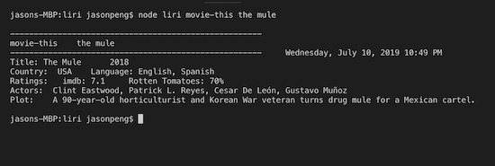
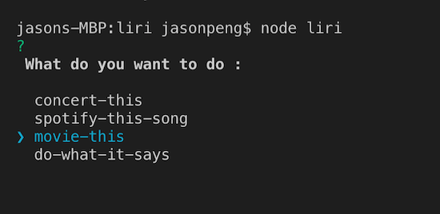

# LIRI 
## Language Interpretation and Recognition Interface

[Watch the 5 min. introduction video](https://drive.google.com/file/d/1k5w3KCjJFb3RyW1K2mdA1jwHcS_cpnFx/view?usp=sharing)

This program is using node.js to call APIs to recommend users for concerts, movies or songs in Spotify.

1. When you type node __**liri spotify-this-song**__ and __a name of a song__, liri program will search Spodity song list and comes with a list of songs. The results include artist name, album names and url for preview.

2. When you type node __**liri movie-this**__ and  __a movie name__, liri program will find a recommended movie. The actors, plots, year of release, languages and ratings will be shown with the movie.

3. When you type __**node liri concert-this**__ and __an artist name__, liri program will find available concerts performed by the artists for you. The information includes the venus, cities, countries and dates.

4. If you are not sure what to do, you can just type __**node liri do-what-it-says**__, liri program will randomly pick an activity for you. It could be a movie, concerts or songs from Spotify. It is randomly select from random.txt.



------
* This liri program also supports interactive mode. If you just type __**node liri**__ and enter, liri program will prompt you 4 choices for you to select and then ask you to enter the name of artist, movie or song and provide recommendations accordingly.




* All the search results will be kept in log.txt as long as the search terms and timestamps.

* You can add your favorite activities in the random.txt as follows:

````spotify-this-song, Like a Virgin 

spotify-this-song, I dont care
spotify-this-song, Truth Hurts  
spotify-this-song, Old Town Road 
spotify-this-song, sucker
spotify-this-song, sunflower
spotify-this-song, You Need To Calm Down

movie-this,   "the mule"
movie-this, toy story 4
movie-this, yesterday
movie-this, The Lion King

concert-this, Billie Eilish  ````
  


